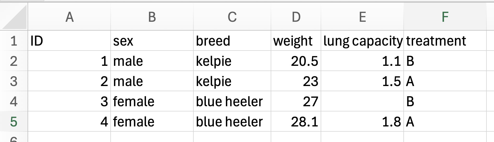
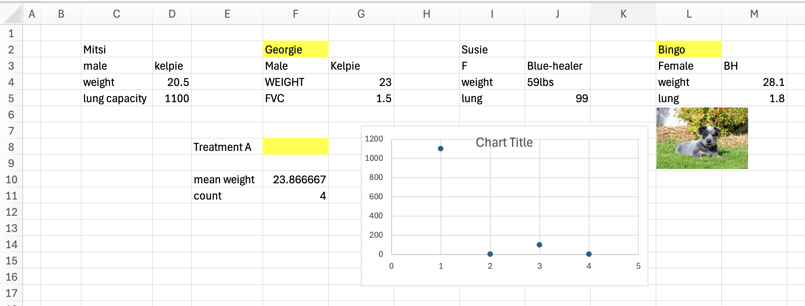

```{r}
#| label: setup
pacman::p_load(
  tidyverse,
  targets,
  gt,
  patchwork,
  harrypotter,
  effectsize
)
theme_set(theme_bw())
options(
  ggplot2.discrete.colour = function(...) {
    scale_colour_hp_d(option = "Ravenclaw", ...)
  },
  ggplot2.discrete.fill = function(...) {
    scale_fill_hp_d(option = "Ravenclaw", ...)
  }
)
```


# Are you talking to me

## What the f**k are p-values

::: {.callout-tip}
# Take home message
If it is less the 0.05 then you have found something interesting
:::

A p-value is the probability of seeing your data given there is no relationship

## Example
Is there a difference in weight between Rottweilers and Chihuahuas

```{r}
df <- tibble(
  breed = rep(
    c("Rottweiler", "Chihuahua"),
    each = 30
  ),
  weight = c(
    rnorm(30, 30, 1),
    rnorm(30, 2, 1)
  )
)
df |>
  ggplot(aes(weight, fill = breed)) +
  geom_histogram(col = "black")
```


## Example
```{r}
t.test(weight ~ breed, data = df)
```


## How confident are you

::: {.callout-tip}
# Take home message
The best way to summarise data is the 95% confidence interval
:::

## Example

What is the average weight of a Chinstrap penguin?

```{r}
data(penguins, package = "palmerpenguins")
chinstrap <- penguins |>
  filter(species == "Chinstrap")
t.test(chinstrap$body_mass_g)
```


## Effect sizes
::: {.callout-tip}
# Take home message
Significant does not mean important. Use effects sizes as well
:::

## Bad Example

```{r}
set.seed(2026)
n <- 1000
df1 <- tibble(
  treatment = rep(c("A", "B"), each = n),
  lung_capacity = c(
    rnorm(n = n, mean = 170, sd = 1),
    rnorm(n = n, mean = 169, sd = 1)
  )
)
t.test(
  lung_capacity ~ treatment,
  data = df1
)
cohens_d(lung_capacity ~ treatment, data = df1)
```

## Good Example

```{r}
set.seed(2026)
n <- 10
df1 <- tibble(
  treatment = rep(c("A", "B"), each = n),
  lung_capacity = c(
    rnorm(n = n, mean = 170, sd = 1),
    rnorm(n = n, mean = 150, sd = 1)
  )
)
t.test(
  lung_capacity ~ treatment,
  data = df1
)
cohens_d(lung_capacity ~ treatment, data = df1)
```


# What do I do now?

## Steps

1. Decide on an outcome and a predictor
2. Identify the type of variables:
    - categorical - labels
    - numeric - numbers
3. Choose the correct test. 


## Tests

```{r}
# side-by-side boxplot ----
df <- tibble(
  Tx = LETTERS[1:3],
  m = c(5, 15, 10),
  sd = rep(1, 3)
)
p1 <- df |>
  rowwise() |>
  mutate(data = list(rnorm(10, m, sd))) |>
  unnest(data) |>
  ggplot(aes(Tx, data, fill = Tx)) +
  geom_boxplot(show.legend = FALSE) +
  harrypotter::scale_fill_hp_d("Ravenclaw") +
  labs(y = "Outcome", title = "T-test/ANOVA")

# filled bar-chart ----
df <- tibble(
  Tx = sample(LETTERS[1:3], size = 100, replace = TRUE),
  outcome = sample(c("success", "failure"), size = 100, replace = TRUE),
)
p2 <- df |>
  ggplot(aes(Tx, fill = outcome)) +
  geom_bar(position = "dodge", col = "black") +
  harrypotter::scale_fill_hp_d("Ravenclaw") +
  labs(
    y = "Proportion",
    fill = NULL,
    title = "Chi-square"
  ) +
  theme(legend.justification = "top", legend.key.size = unit(2, 'mm'))
# scatterplot ----
df <- tibble(
  predictor = rnorm(100),
  outcome = 1 + 2 * predictor + rnorm(100)
)
p3 <- df |>
  ggplot(aes(predictor, outcome)) +
  geom_point() +
  labs(title = "Linear regression")

# logistic regression ----
df <-
  tibble(
    x = rnorm(100),
    p = exp(x) / (1 + exp(x)),
    y = rbinom(100, 1, p)
  )
p4 <- df |>
  ggplot(aes(x, y, col = y > 0)) +
  geom_point(show.legend = FALSE) +
  harrypotter::scale_colour_hp_d("Ravenclaw") +
  geom_smooth(
    aes(group = 1),
    method = "glm",
    method.args = list(family = "binomial"),
    se = FALSE,
    col = "black"
  ) +
  labs(
    x = "Predictor",
    y = "Outcome",
    title = "Logistic regression"
  ) +
  scale_y_continuous(
    breaks = c(0, 1),
    labels = c("failure", "success")
  )
((p4 + p2) / (p3 + p1)) |> print()
```

## T-test
Compare two means

**Example**: weight gain in lambs for two different diets

## ANOVA
Compare three or more means

**Example**: Cost on gumtree for breeds of dogs. 

## Chi-square
Are two categorical variables related

**Example**: Does breed of a dog have an effect on hepatic cancers that are encountered. 

## Regression
Are two numerical variables related

**Example**: What is the relationship between dog weight and chemotherapy dose?

## Logistic regression
Predict an outcome that is success or failure.

**Example**: Does surgical margins effect relapse of gingival melanomas?

# DIY time

## Scenario 1
A veterinary hospital wants to know what predicts whether a dog develops a surgical site infection (SSI) within 14 days of orthopedic surgery. They have measured the duration of surgery in minutes. 

## Scenario 2
A feline-only practice wants to compare mean time to full recovery (extubation to standing/walking, in minutes) after ovariohysterectomy across three anesthetic protocols.

- Protocol A: Dexmedetomidine–ketamine–butorphanol
- Protocol B: Alfaxalone–midazolam
- Protocol C: Propofol–isoflurane maintenance

# How to make a statistician happy. 

## Have a good spreadsheets


::: {.callout-tip}
# Take home message
Collect your data well, it makes the analysis easier. 
:::

## What I dream off


::: {.columns}

::: {.column}

- Clear headers
- Each row is a subject
- Each column is a variable
- Consistent values
- Missing is just blank

:::

::: {.column}



:::

:::

## My nightmare



## Have a clear research question
::: {.callout-tip}
# Take home message
Think carefully about your research question and how you can convert this into stats-lingo. 
:::

##

{.r-stretch style="display: block; margin: 0 auto;"}